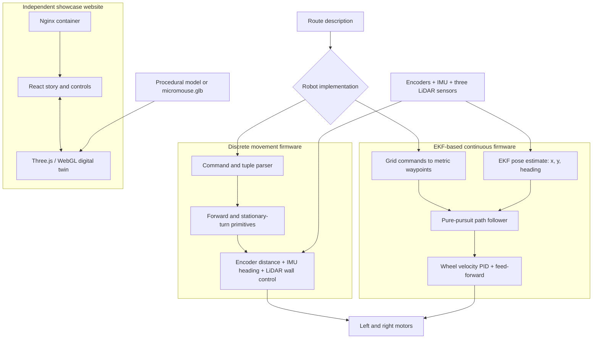
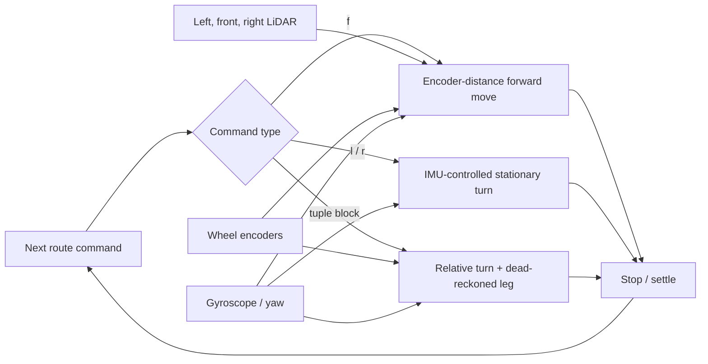
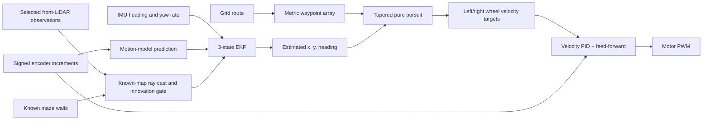
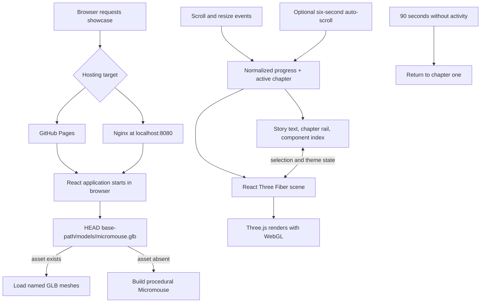

# UNSW Micromouse Demo Day

**[Open the live Micromouse 3D showcase](https://randomrunt.github.io/UNSWMicromouseDemo/)**

This repository brings together the robot-control software and interactive presentation material for a UNSW Micromouse demonstration. Its two primary robot implementations solve the same maze-driving problem in different ways:

1. **Discrete movement** executes explicit forward legs and stationary turns.
2. **EKF-based continuous movement** estimates the robot's pose and follows a waypoint path with pure pursuit.

An HC-06-enabled variant of the discrete controller also streams route and sensor events over Bluetooth for demonstration monitoring.

The repository also contains a static 3D showcase website that can run from GitHub Pages or a Dockerized Nginx server. It explains the robot, its sensors, its control pipeline, and its motion to visitors, but does not send commands to the physical robot or receive live telemetry.

For a detailed comparison of every retained implementation, see [IMPLEMENTATIONS.md](IMPLEMENTATIONS.md).

## Repository overview

| Path | Role |
|---|---|
| [`DemoBotDiscreteMove/`](DemoBotDiscreteMove/) | Primary discrete-motion implementation for the DemoBot hardware |
| [`DemoBotDiscreteMoveBluetooth/`](DemoBotDiscreteMoveBluetooth/) | Discrete-motion variant with one-way HC-06 event and sensor telemetry |
| [`DemoBotPPEKF/`](DemoBotPPEKF/) | Primary continuous pure-pursuit and EKF implementation |
| [`DemoBotPinDetails4.1/`](DemoBotPinDetails4.1/) | Earlier Task 4.1-style controller and hardware baseline |
| [`Best_Micromouse_Implementations_26T2/`](Best_Micromouse_Implementations_26T2/) | Full reference implementations, computer-vision work, mapping tools, and generated route/map data |
| [`micromouse-showcase/`](micromouse-showcase/) | React/Three.js 3D showcase, tests, Docker image, and Nginx configuration |
| [`.github/workflows/micromouse-showcase.yml`](.github/workflows/micromouse-showcase.yml) | Website test, build, container, and publishing pipeline |

## Whole-system view



The firmware paths are alternative controllers for the physical robot. The website is a separate static application that communicates the same sensing-estimation-control concepts visually.

## Implementation 1: discrete movement

The primary discrete controller lives in [`DemoBotDiscreteMove/`](DemoBotDiscreteMove/). It treats a route as a sequence of self-contained actions. A typical route uses:

```cpp
const char ROUTE[] PROGMEM = "ffrfl";
```

- `f` drives forward by one 180 mm maze cell;
- `l` performs a stationary 90-degree left turn;
- `r` performs a stationary 90-degree right turn.

Adjacent forward commands are combined into a longer forward leg. The controller completes one action, settles where necessary, and then starts the next action.

### Discrete control flow



During normal forward motion, encoder travel provides the primary distance measurement. IMU heading feedback keeps the robot pointing along the committed direction. Side LiDAR measurements add wall-heading and centring corrections when valid walls are visible. Front-wall logic is only enabled near an expected endpoint, reducing the chance that an unrelated object ends a move prematurely.

Turns use IMU feedback with proportional/derivative control and must remain within heading and angular-rate tolerances for a stable period before completing. Timeouts, sensor validation, PWM limits, acceleration/deceleration limits, and safe motor reversal provide fault containment.

### Task 4.2 tuple movement

The discrete implementation can also execute one camera-derived tuple block:

```cpp
const char ROUTE[] PROGMEM =
    "fr,[(58.1,287.4),(-3.9,116.7),(-64.3,377.6),],fl";
```

Each tuple is `(clockwise turn degrees, forward distance millimetres)`. Tuple legs use encoder distance and IMU heading without LiDAR wall correction, so cylindrical obstacles are not mistaken for maze walls. The parser validates syntax, numeric limits, and route structure before the motors run.

### Bluetooth telemetry variant

[`DemoBotDiscreteMoveBluetooth/`](DemoBotDiscreteMoveBluetooth/) retains the discrete controller and adds an HC-06 serial link on Arduino pins D4 and D5 at 9600 baud. It reports hardware status, route progress, movement targets, heading, encoder rotations, and three LiDAR readings. The link is output-only: the checked-in sketch starts its compile-time route automatically and does not accept remote drive commands. See the [Bluetooth variant README](DemoBotDiscreteMoveBluetooth/README.md) for wiring and message details.

### Important files

| File | Responsibility |
|---|---|
| [`DemoBotDiscreteMove.ino`](DemoBotDiscreteMove/DemoBotDiscreteMove.ino) | Pin assignments, tuning constants, route parser, movement primitives, setup, and run sequence |
| [`Motor.hpp`](DemoBotDiscreteMove/Motor.hpp) | Motor direction, PWM output, and safe switching |
| [`DualEncoder.hpp`](DemoBotDiscreteMove/DualEncoder.hpp) | Signed left/right encoder counts and wheel rotation |
| [`Imu.hpp`](DemoBotDiscreteMove/Imu.hpp) / [`Imu.cpp`](DemoBotDiscreteMove/Imu.cpp) | MPU6050 initialization, validation, calibration, yaw, and angular rate |
| [`Lidar.hpp`](DemoBotDiscreteMove/Lidar.hpp) / [`Lidar.cpp`](DemoBotDiscreteMove/Lidar.cpp) | VL6180X addressing, non-blocking ranging, and trusted measurements |

### When this approach is useful

The discrete implementation is easier to reason about and tune one primitive at a time. Every route command has a visible action boundary, and failures can be isolated to forward travel, turning, wall alignment, or tuple handling. Its trade-off is that stop-and-turn motion is less fluid, and accumulated position error is represented indirectly through each local movement rather than as one continuous global pose.

## Implementation 2: EKF-based continuous movement

The primary continuous controller lives in [`DemoBotPPEKF/`](DemoBotPPEKF/). “PPEKF” refers to the pairing of **pure pursuit** path following with an **extended Kalman filter** pose estimator.

It accepts the familiar `f`, `l`, and `r` route notation, but interprets it differently. Startup code converts the grid commands into metric waypoints:

```cpp
const char ROUTE_COMMANDS[] PROGMEM = "ffrfl";
```

- `f` adds a waypoint one 180 mm cell ahead;
- `l` rotates the planned direction left before later waypoints are generated;
- `r` rotates the planned direction right.

The turn commands do not directly cause stationary turns. Pure pursuit follows the resulting polyline and rounds corners continuously.

### Continuous control pipeline



### State estimation

The EKF maintains a three-value state:

```text
x position, y position, heading
```

Encoder increments drive the differential-drive motion model. The IMU corrects heading drift. On configured route segments, a trusted front LiDAR measurement can be compared with the expected range obtained by ray-casting against [`MazeMap.hpp`](DemoBotPPEKF/MazeMap.hpp). Measurements outside the configured range or innovation gate are rejected, and accepted position corrections are bounded.

Map-based LiDAR correction is optional because it is only valid when the physical course, route segments, sensor mounting offset, and map agree. It can be disabled independently while retaining encoder/IMU estimation.

### Path and wheel control

Pure pursuit projects the estimated pose onto the route, selects a lookahead point, and calculates path curvature. A preview lookahead reduces speed before sharper turns. Curvature and wheelbase are converted into left and right wheel-speed targets.

The velocity controller compares those targets with measured encoder velocities, applies filtered PID correction and feed-forward, then sends bounded PWM commands to each motor. The control loop is configured for a 5 ms period.

### Important files

| File | Responsibility |
|---|---|
| [`DemoBotPPEKF.ino`](DemoBotPPEKF/DemoBotPPEKF.ino) | Hardware composition, control scheduling, LiDAR polling, and estimator-controller pipeline |
| [`Config.hpp`](DemoBotPPEKF/Config.hpp) | Pins, polarity, geometry, timing, gains, limits, and feature flags |
| [`Route.hpp`](DemoBotPPEKF/Route.hpp) | Route string, initial heading, waypoint generation, and correction segments |
| [`StateEstimator.hpp`](DemoBotPPEKF/StateEstimator.hpp) | EKF prediction and IMU/LiDAR measurement updates |
| [`Model.hpp`](DemoBotPPEKF/Model.hpp) | Differential-drive process model, Jacobian, and noise models |
| [`PurePursuit.hpp`](DemoBotPPEKF/PurePursuit.hpp) | Lookahead, segment progression, curvature, and speed tapering |
| [`VelocityController.hpp`](DemoBotPPEKF/VelocityController.hpp) | Per-wheel velocity feedback and motor output |
| [`MazeMap.hpp`](DemoBotPPEKF/MazeMap.hpp) / [`MapRay.hpp`](DemoBotPPEKF/MapRay.hpp) | Known wall geometry and expected-range calculation |

See the [PPEKF implementation README](DemoBotPPEKF/README.md) for setup checks and route/map consistency requirements.

### When this approach is useful

The continuous implementation produces smoother motion and exposes a meaningful global pose that can support more advanced navigation. It also separates estimation, geometric path following, and wheel-speed control into clear layers. Its trade-off is greater calibration and configuration sensitivity: wheel geometry, encoder signs, IMU convention, route coordinates, known walls, LiDAR mounting, estimator noise, lookahead, and velocity gains must all agree.

## Comparing the primary robot implementations

| Concern | Discrete movement | EKF-based movement |
|---|---|---|
| Route representation | Actions: forward, stationary left, stationary right, optional tuple block | Grid commands converted to metric waypoints |
| Corner behavior | Stop, rotate, settle, then drive | Continuous path curvature with tapered speed |
| Position representation | Per-action distance and committed heading | Continuous `(x, y, heading)` estimate |
| Encoder role | Forward distance and heading assistance | Motion prediction and wheel-velocity measurement |
| IMU role | Heading hold, calibrated relative turns, settling | EKF heading observation and segment re-anchoring |
| LiDAR role | Side-wall following, centring, and front arrival | Optional map-based front-range position correction |
| Controller output | Direct bounded left/right PWM for each movement primitive | Left/right velocity targets followed by PID and feed-forward |
| Task 4.2 tuples | Supported | Not supported |
| Main strength | Simplicity, explicit actions, isolated tuning | Smooth motion, continuous pose, extensible navigation stack |
| Main risk | Stop/start inefficiency and local accumulated error | Sensitivity to model, map, sensor, and gain consistency |

These are alternatives rather than layers that run together. Build and upload one sketch at a time.

## Hardware assumptions and safety

The primary sketches target the repository's DemoBot wiring: two independently driven wheels, quadrature encoders, an MPU6050-class IMU, and three VL6180X time-of-flight sensors. Pin assignments, motor/encoder polarity, wheel radius, wheelbase, and sensor order are implementation configuration—not universal hardware facts.

Before running on the floor:

1. Raise or restrain the robot and verify motor directions.
2. Confirm both encoder signs increase for forward wheel movement.
3. Confirm the IMU heading sign matches the implementation convention.
4. Verify left/front/right LiDAR addressing and mounting order.
5. Measure wheel radius, wheelbase, and the front-sensor offset.
6. Start with conservative PWM/speed settings and provide a physical stop method.
7. For PPEKF, set `MOTORS_ENABLED` to `false` for estimator-only bench testing and disable map correction until the route and map match.

Do not upload a reference implementation without reviewing its wiring assumptions. The reference folders use a different LiDAR XSHUT order from the DemoBot implementations; details are recorded in [IMPLEMENTATIONS.md](IMPLEMENTATIONS.md#hardware-warning).

## Micromouse showcase website

[`micromouse-showcase/`](micromouse-showcase/) is a separate React and Three.js application designed for a full-screen Demo Day display. It presents six scroll-driven chapters:

1. Meet the robot.
2. Explode and inspect its components.
3. Visualize its range sensors, encoders, and IMU.
4. Explain the sense-estimate-follow-drive control chain.
5. Show movement through a simplified maze.
6. Release the camera for visitor exploration.

It uses **React with Vite**, not Next.js. Node.js exists only in the build stage. The production container contains Nginx and the generated static HTML, CSS, JavaScript, and model assets.

### How the website works



The page has two synchronized presentation layers:

- **Semantic HTML** contains the story, chapter navigation, theme switch, component buttons, detail cards, focus behavior, and screen-reader announcements.
- **WebGL** renders the robot, camera movement, exploded offsets, sensor beams, maze path, lighting, and final orbit controls.

`App.tsx` owns the shared chapter, selection, asset, reduced-motion, theme, and auto-scroll state. Native scroll position is normalized from 0 to 1, and the active chapter drives both the DOM presentation and the 3D choreography. Selecting a component through HTML or the 3D model updates the same component state. The optional auto-scroll control advances to the next chapter every six seconds and loops back to the first chapter after the final one.

At startup, the app checks for the exported digital twin at `public/models/micromouse.glb`. If it is unavailable, a deterministic procedural robot keeps the complete experience operational. The GLB must follow the documented mesh-name contract.

Light and graphite-grey dark themes affect both CSS and the 3D environment. The visitor's choice is saved in browser storage. Reduced-motion preferences limit animation, and a 90-second inactivity timer resets the kiosk.

### Website deployment

The Docker image uses a multi-stage build:

```text
React + TypeScript + Three.js source
                |
                v
Node 24 build stage: npm ci + npm run build
                |
                v
Vite dist/ static bundle
                |
                v
Nginx runtime image on container port 80
                |
                v
Docker Compose publishes http://localhost:8080
```

To run it:

```powershell
cd micromouse-showcase
docker compose up --build -d
```

Open `http://localhost:8080`, or use the [live GitHub Pages deployment](https://randomrunt.github.io/UNSWMicromouseDemo/). See the [showcase operation guide](micromouse-showcase/README.md) for local and hosted deployment details, and the [website architecture README](micromouse-showcase/docs/architecture/README.md) for the full runtime, scene, accessibility, model, testing, and deployment design.

The website workflow installs locked dependencies, runs unit and Chromium browser tests, builds the Vite application and Docker image, and then publishes both a GitHub Pages artifact and tagged GitHub Container Registry images after successful pushes to `main`. The Pages build uses `/UNSWMicromouseDemo/` as its Vite base path; local and Docker builds continue to use `/`.

## Reference implementations and supporting work

[`Best_Micromouse_Implementations_26T2/`](Best_Micromouse_Implementations_26T2/) retains the fuller implementations from which the DemoBot-focused controllers were adapted:

- `micromouse-BestDiscreteMove` adds autonomous maze mapping and planning to the discrete approach.
- `F12A_T03-Micromouse-TaperedPPEKF` is the original tapered pure-pursuit/EKF reference.
- `ComputerVision-BestDiscreteMove` contains course-image processing notebooks.
- The PPEKF `high_level/` tools extract walls and obstacles, construct occupancy data, plan a path, and export waypoint/map headers.

These folders are valuable references, but their hardware pins, sensor order, geometry, generated maps, and route formats should not be assumed to match the primary DemoBot sketches.

## Suggested starting points

- To understand or tune stop-and-turn behavior, start with [`DemoBotDiscreteMove/DemoBotDiscreteMove.ino`](DemoBotDiscreteMove/DemoBotDiscreteMove.ino).
- To monitor the discrete controller over an HC-06 link, read [`DemoBotDiscreteMoveBluetooth/README.md`](DemoBotDiscreteMoveBluetooth/README.md).
- To study continuous estimation and control, start with [`DemoBotPPEKF/README.md`](DemoBotPPEKF/README.md), then follow `DemoBotPPEKF.ino` through `StateEstimator`, `PurePursuit`, and `VelocityController`.
- To compare all retained controllers and route formats, read [IMPLEMENTATIONS.md](IMPLEMENTATIONS.md).
- To operate the visitor-facing site, read [`micromouse-showcase/README.md`](micromouse-showcase/README.md).
- To understand the site's internals, read [`micromouse-showcase/docs/architecture/README.md`](micromouse-showcase/docs/architecture/README.md).
