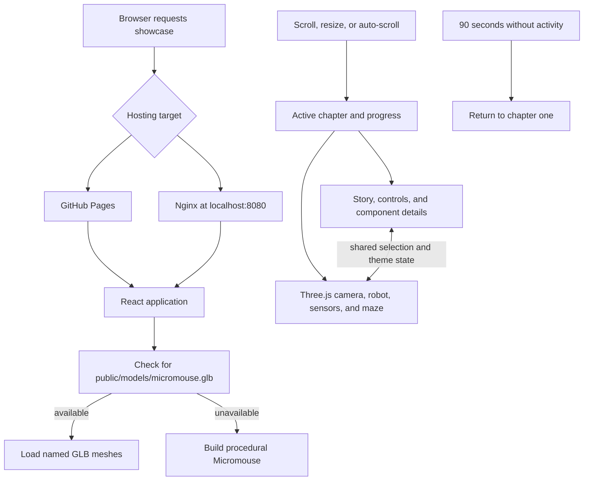
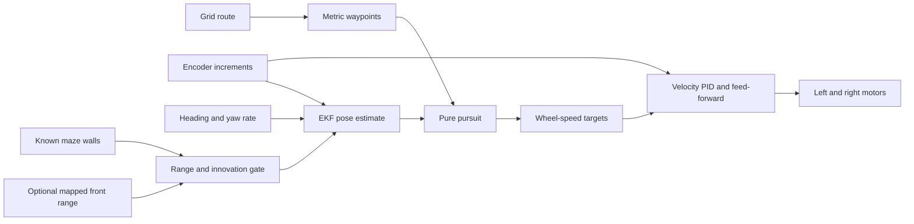

# UNSW Micromouse Demo Day

**[Open the live Micromouse 3D showcase](https://randomrunt.github.io/UNSWMicromouseDemo/)**

This repository contains the visitor-facing Micromouse showcase website, its presentation resources, and the 2026 Term 2 robot and computer-vision reference implementations. The website is the primary entry point; the implementation archive documents the firmware, sensing, estimation, planning, and control work behind the demonstration.

The website is a standalone visual experience. It does not send commands to the physical robot or receive live telemetry.

## Repository structure

```text
UNSWMicromouseDemo/
├── .github/
│   └── workflows/
│       └── micromouse-showcase.yml       # Website CI and publishing
├── micromouse-showcase/                   # React/Three.js showcase website
│   ├── cad/                               # Model sources and CAD workflow files
│   │   ├── blender/                       # Blender materials and working assets
│   │   ├── reference/                     # Component and modelling notes
│   │   └── source/                        # Source CAD exports
│   ├── docs/
│   │   └── architecture/                  # Detailed website architecture
│   ├── public/
│   │   ├── images/                        # Static image assets
│   │   ├── models/                        # Runtime GLB model
│   │   └── textures/                      # Runtime texture assets
│   ├── src/
│   │   ├── components/                    # UI and overlay components
│   │   ├── config/                        # Asset, component, and responsive config
│   │   ├── scene/                         # React Three Fiber scene and animation
│   │   ├── story/                         # Chapters, scrolling, and viewport hooks
│   │   ├── styles/                        # Global presentation styles
│   │   ├── types/                         # Shared TypeScript types
│   │   ├── App.tsx                        # Application state and composition
│   │   └── main.tsx                       # Browser entry point
│   ├── tests/                             # Asset-contract and browser tests
│   ├── Dockerfile                         # Production container build
│   ├── docker-compose.yml                 # Local Nginx deployment
│   ├── package.json                       # Dependencies and npm scripts
│   └── README.md                          # Website operation guide
├── micromouse-reference-implementations-26t2/
│   ├── ComputerVision-BestDiscreteMove/   # Task 4.1/4.2 vision notebooks
│   ├── DemoBotDiscreteMove/               # DemoBot stop-and-turn controller
│   ├── DemoBotDiscreteMoveBluetooth/      # Discrete controller with telemetry
│   ├── DemoBotPinDetails4.1/              # Earlier DemoBot hardware baseline
│   ├── DemoBotPPEKF/                      # DemoBot pure-pursuit/EKF controller
│   ├── F12A_T03-Micromouse-TaperedPPEKF/  # Original continuous-path reference
│   ├── micromouse-BestDiscreteMove/        # Full mapping/planning reference
│   └── IMPLEMENTATIONS.md                 # Detailed firmware comparison
├── showcase-resources/
│   ├── DemoPoster.pptx                    # Editable presentation poster
│   ├── MicromouseDemoQRCode.svg           # Scalable showcase QR code
│   └── MicromouseWebsiteDemoPoster.jpg     # Raster poster/website asset
├── .gitignore
└── README.md
```

| Area | Purpose |
|---|---|
| [`micromouse-showcase/`](micromouse-showcase/) | Interactive website, 3D assets, tests, and deployment configuration |
| [`micromouse-reference-implementations-26t2/`](micromouse-reference-implementations-26t2/) | Arduino controllers, computer-vision work, mapping tools, and generated route/map data |
| [`showcase-resources/`](showcase-resources/) | Poster and QR-code resources used for Demo Day |
| [`.github/workflows/micromouse-showcase.yml`](.github/workflows/micromouse-showcase.yml) | Website test, build, container, and GitHub Pages pipeline |

## Micromouse showcase website

[`micromouse-showcase/`](micromouse-showcase/) is a full-screen, scroll-driven Demo Day experience built with React, TypeScript, Vite, React Three Fiber, and Three.js. It presents six chapters:

1. Meet the robot.
2. Explode and inspect its components.
3. Visualize its range sensors, encoders, and IMU.
4. Explain the sense-estimate-follow-drive control chain.
5. Show movement through a simplified maze.
6. Release the camera for visitor exploration.

### How the website works



The presentation has two synchronized layers:

- Semantic HTML provides the story, chapter navigation, theme control, component buttons, detail cards, keyboard focus, and screen-reader announcements.
- WebGL renders the robot, exploded component positions, sensor beams, camera motion, maze path, lighting, and final orbit controls.

[`App.tsx`](micromouse-showcase/src/App.tsx) owns the shared chapter, selection, asset, reduced-motion, theme, and auto-scroll state. The app normalizes native scroll position from 0 to 1 so the active chapter can drive both the interface and the 3D choreography.

At startup, the app checks for [`public/models/micromouse.glb`](micromouse-showcase/public/models/micromouse.glb). If the exported digital twin is unavailable, a deterministic procedural model keeps the complete experience operational. Light and graphite-grey themes affect both the HTML and 3D environment, while reduced-motion preferences limit animation.

### Run the website locally

Requirements: Node.js 24 and npm.

```powershell
cd micromouse-showcase
npm ci
npm run dev
```

Vite prints the local development URL. Before submitting website changes, run:

```powershell
npm test
npm run test:e2e
npm run build
```

### Run the production container

The Docker image builds the Vite application with Node.js, then serves the generated static bundle from Nginx:

```powershell
cd micromouse-showcase
docker compose up --build -d
```

Open `http://localhost:8080`.

### Continuous integration and deployment

The workflow remains at the repository-level path [`.github/workflows/micromouse-showcase.yml`](.github/workflows/micromouse-showcase.yml), as required by GitHub Actions. Its commands run inside `micromouse-showcase/`.

For pull requests and pushes to `main`, the workflow installs locked dependencies, runs unit and Chromium browser tests, builds the production website, and verifies the Docker image. After a successful push to `main`, it publishes:

- the static site to [GitHub Pages](https://randomrunt.github.io/UNSWMicromouseDemo/); and
- `latest` and commit-specific container images to GitHub Container Registry.

The Pages build uses `/UNSWMicromouseDemo/` as its Vite base path. Local and Docker builds use `/`.

For deeper website documentation, see the [website operation guide](micromouse-showcase/README.md), [architecture guide](micromouse-showcase/docs/architecture/README.md), and [Fusion-to-web workflow](micromouse-showcase/FUSION_TO_WEB_WORKFLOW.md).

## Reference implementations

All firmware and supporting computer-vision work is grouped under [`micromouse-reference-implementations-26t2/`](micromouse-reference-implementations-26t2/). Each Arduino sketch is a separate build: open the `.ino` file inside the selected implementation folder and upload only that sketch.

See the [complete implementations guide](micromouse-reference-implementations-26t2/IMPLEMENTATIONS.md) for route formats, configuration points, and implementation-specific cautions.

### Implementation overview

| Implementation | Purpose | Route input |
|---|---|---|
| [`DemoBotDiscreteMove`](micromouse-reference-implementations-26t2/DemoBotDiscreteMove/) | Primary DemoBot controller with explicit forward legs and stationary turns | Compile-time `f`, `l`, `r` string with an optional Task 4.2 tuple block |
| [`DemoBotDiscreteMoveBluetooth`](micromouse-reference-implementations-26t2/DemoBotDiscreteMoveBluetooth/) | Discrete controller with one-way HC-06 events and sensor telemetry | Same route format as `DemoBotDiscreteMove` |
| [`DemoBotPPEKF`](micromouse-reference-implementations-26t2/DemoBotPPEKF/) | Continuous pure-pursuit controller with EKF pose estimation | Compile-time `f`, `l`, `r` string converted to waypoints |
| [`DemoBotPinDetails4.1`](micromouse-reference-implementations-26t2/DemoBotPinDetails4.1/) | Earlier Task 4.1 controller and DemoBot hardware baseline | Compile-time `f`, `l`, `r` string |
| [`micromouse-BestDiscreteMove`](micromouse-reference-implementations-26t2/micromouse-BestDiscreteMove/) | Full Task 4.1/4.2 command and Task 4.3 autonomous mapping reference | Command string or autonomous start/goal configuration |
| [`F12A_T03-Micromouse-TaperedPPEKF`](micromouse-reference-implementations-26t2/F12A_T03-Micromouse-TaperedPPEKF/) | Original tapered pure-pursuit/EKF reference | Explicit waypoint array |
| [`ComputerVision-BestDiscreteMove`](micromouse-reference-implementations-26t2/ComputerVision-BestDiscreteMove/) | Course-image processing for Tasks 4.1 and 4.2 | Images processed by Jupyter notebooks |

### Discrete DemoBot controller

[`DemoBotDiscreteMove/`](micromouse-reference-implementations-26t2/DemoBotDiscreteMove/) treats a route as a sequence of self-contained actions:

```cpp
const char ROUTE[] PROGMEM = "ffrfl";
```

- `f` drives forward by one 180 mm maze cell.
- `l` performs a stationary 90-degree left turn.
- `r` performs a stationary 90-degree right turn.

Adjacent forward commands are combined into longer legs. Encoder travel supplies the primary distance measurement, IMU feedback maintains heading, side LiDAR measurements correct wall heading and centring, and front-wall logic assists near expected endpoints.

The implementation can also execute one camera-derived Task 4.2 tuple block:

```cpp
const char ROUTE[] PROGMEM =
    "fr,[(58.1,287.4),(-3.9,116.7),(-64.3,377.6),],fl";
```

Each tuple is `(clockwise turn degrees, forward distance millimetres)`. LiDAR wall correction is disabled during tuple legs so cylindrical obstacles are not interpreted as walls.

The [Bluetooth variant](micromouse-reference-implementations-26t2/DemoBotDiscreteMoveBluetooth/) adds an HC-06 serial connection on Arduino pins D4 and D5 at 9600 baud. It reports status, route progress, targets, heading, encoder rotations, and LiDAR measurements. It is output-only and does not accept remote driving commands.

### Continuous DemoBot controller

[`DemoBotPPEKF/`](micromouse-reference-implementations-26t2/DemoBotPPEKF/) combines pure-pursuit path following with an extended Kalman filter pose estimator. It accepts the same grid notation:

```cpp
const char ROUTE_COMMANDS[] PROGMEM = "ffrfl";
```

Here, the route is converted into metric waypoints. Turn commands change the direction used to generate subsequent waypoints; they do not cause stationary turns. Pure pursuit follows the resulting polyline and rounds corners continuously.



The EKF estimates `(x, y, heading)` from encoder and IMU observations, with optional front-LiDAR corrections against a known wall map. The velocity controller converts pursuit curvature into left and right wheel-speed targets and applies bounded PID and feed-forward output.

### Comparing the primary controllers

| Concern | Discrete movement | EKF-based movement |
|---|---|---|
| Route interpretation | Forward and stationary-turn actions | Grid commands converted to metric waypoints |
| Corner behaviour | Stop, rotate, settle, then drive | Continuous curvature with tapered speed |
| Position representation | Per-action distance and committed heading | Continuous `(x, y, heading)` estimate |
| Encoder role | Forward distance and heading assistance | Motion prediction and wheel-velocity measurement |
| IMU role | Heading hold, relative turns, and settling | EKF heading observation and re-anchoring |
| LiDAR role | Wall following, centring, and arrival assistance | Optional map-based position correction |
| Task 4.2 tuples | Supported | Not supported |
| Main strength | Simpler primitives and isolated tuning | Smooth motion and extensible pose estimation |
| Main risk | Stop/start inefficiency and accumulated local error | Sensitivity to model, map, sensor, and gain consistency |

These are alternative controllers; they do not run together.

### Full references and supporting work

The archive also retains the larger implementations from which the DemoBot-focused controllers were adapted:

- [`micromouse-BestDiscreteMove/`](micromouse-reference-implementations-26t2/micromouse-BestDiscreteMove/) adds autonomous maze mapping and planning to the discrete approach.
- [`F12A_T03-Micromouse-TaperedPPEKF/`](micromouse-reference-implementations-26t2/F12A_T03-Micromouse-TaperedPPEKF/) is the original continuous tapered pure-pursuit/EKF implementation.
- [`ComputerVision-BestDiscreteMove/`](micromouse-reference-implementations-26t2/ComputerVision-BestDiscreteMove/) contains the course-image processing notebooks.
- [`F12A_T03-Micromouse-TaperedPPEKF/high_level/`](micromouse-reference-implementations-26t2/F12A_T03-Micromouse-TaperedPPEKF/high_level/) contains tools and generated outputs for wall extraction, occupancy generation, path planning, and waypoint/map header export.

### Hardware assumptions and safety

The DemoBot sketches assume two independently driven wheels, quadrature encoders, an MPU6050-class IMU, and three VL6180X time-of-flight sensors. Pin assignments, polarity, wheel radius, wheelbase, sensor mounting, and sensor order are implementation-specific.

Before running the robot:

1. Raise or restrain it and verify both motor directions.
2. Confirm both encoder signs increase for forward wheel movement.
3. Confirm the IMU heading sign matches the selected controller.
4. Verify left, front, and right LiDAR addressing and mounting order.
5. Measure wheel radius, wheelbase, and front-sensor offset.
6. Begin with conservative speed settings and a physical stop method.
7. For PPEKF, test with `MOTORS_ENABLED` set to `false` and leave map correction disabled until its route and wall map agree.

Do not upload an archived implementation without reviewing its wiring assumptions. In particular, the LiDAR XSHUT order differs between the DemoBot and full reference implementations; see the [hardware warning](micromouse-reference-implementations-26t2/IMPLEMENTATIONS.md#hardware-warning).

## Showcase resources

[`showcase-resources/`](showcase-resources/) contains the editable PowerPoint poster, the scalable QR code for the live website, and the raster poster/website image. These files support the physical Demo Day display and are kept separate from both the deployable website and implementation archive.

## Suggested starting points

- To operate or develop the website, start with [`micromouse-showcase/README.md`](micromouse-showcase/README.md).
- To understand the website internals, read the [architecture guide](micromouse-showcase/docs/architecture/README.md).
- To compare firmware and route formats, read [`IMPLEMENTATIONS.md`](micromouse-reference-implementations-26t2/IMPLEMENTATIONS.md).
- To tune stop-and-turn movement, start with [`DemoBotDiscreteMove.ino`](micromouse-reference-implementations-26t2/DemoBotDiscreteMove/DemoBotDiscreteMove.ino).
- To use HC-06 monitoring, read the [Bluetooth controller guide](micromouse-reference-implementations-26t2/DemoBotDiscreteMoveBluetooth/README.md).
- To study continuous estimation and control, start with the [PPEKF guide](micromouse-reference-implementations-26t2/DemoBotPPEKF/README.md).
