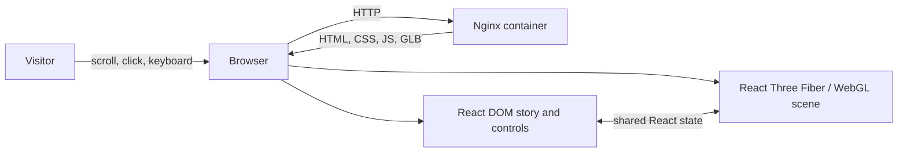
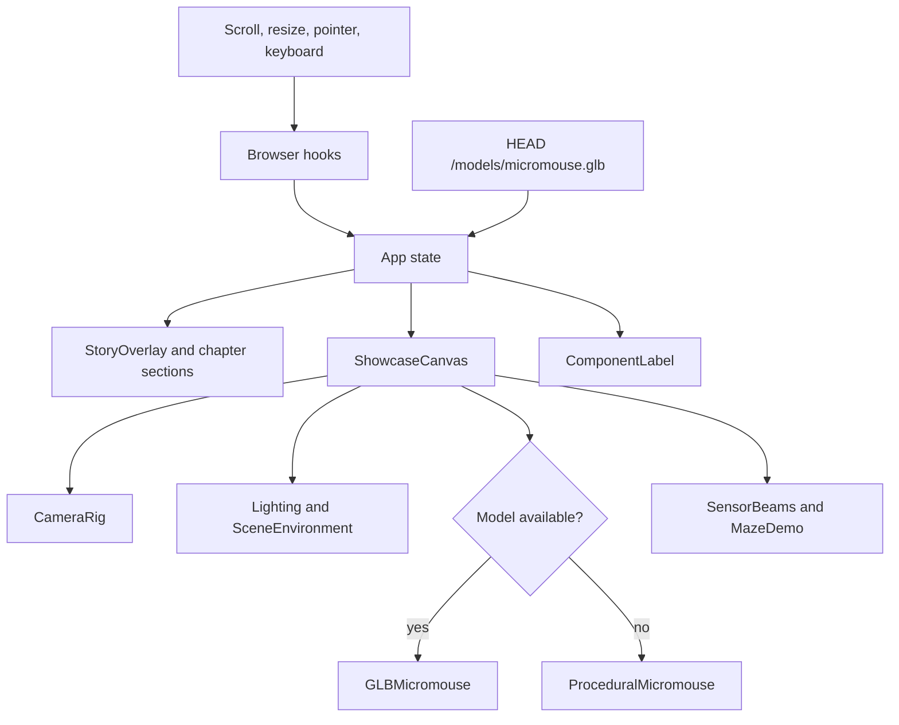
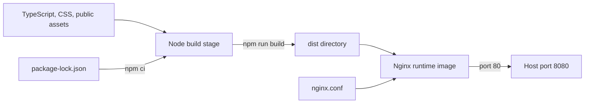

# Micromouse Showcase System Architecture

This document describes the implemented software architecture of the Micromouse 3D Showcase. The system is a browser-only, deterministic presentation deployed as static files. It has no backend service, database, live telemetry dependency, or runtime internet requirement.

For operating instructions, see the [project README](../../README.md). For the 3D asset preparation process, see the [Fusion-to-web workflow](../../FUSION_TO_WEB_WORKFLOW.md).

## System context



Nginx serves the application and its assets. After the initial download, all storytelling, rendering, interaction, theming, and kiosk behavior execute in the browser.

## Technology layers

| Layer | Technology | Responsibility |
|---|---|---|
| Deployment | Docker Compose | Builds, publishes port 8080, and restarts the service |
| Static server | Nginx | Serves the bundle, caches assets, provides SPA fallback and health checks |
| Build | Node.js, npm, Vite, TypeScript | Installs locked dependencies, type-checks, and creates `dist/` |
| UI | React | Owns application state, story content, controls, themes, and accessibility equivalents |
| 3D integration | React Three Fiber and Drei | Maps React components to the Three.js scene and provides controls/helpers |
| Rendering | Three.js and WebGL | Renders the robot, lighting, maze, beams, grid, and animations |
| Styling | CSS | Provides layout, responsive behavior, light/dark tokens, and reduced-motion handling |
| Verification | Vitest, Playwright, axe-core | Checks the model contract, user journeys, viewports, and accessibility |

## Runtime composition

`src/App.tsx` is the composition root. It owns the small amount of shared state and passes explicit props into the DOM overlay and the WebGL scene.



### Shared state

| State | Source | Consumers |
|---|---|---|
| Normalized scroll progress | `useScrollProgress` | Camera choreography and story transitions |
| Active chapter | `useScrollProgress` | Story overlay, scene effects, exploded model state, controls |
| Selected component | Component index or 3D pointer event | Model highlight, pressed state, component detail card |
| Theme | Saved preference or OS preference | CSS token system, canvas background, fog, grid, scene lighting |
| Reduced motion | `prefers-reduced-motion` | Camera and object animation behavior |
| GLB availability | Startup `HEAD` request | Selection between the GLB and procedural model |

No external state library is required because this state is local, shallow, and has a single composition root.

## Story and animation flow

The page contains six full-height semantic sections defined by `src/story/chapters.ts`:

1. Meet the Micromouse
2. What is inside?
3. How does it sense?
4. How does it think?
5. How does it move?
6. Explore it yourself

`useScrollProgress` converts `window.scrollY` into a value from 0 to 1 and derives the active chapter. Scroll updates are limited to one state update per animation frame. `CameraRig` and scene components map the current chapter to target positions and interpolate toward them in the render loop.

The final chapter enables orbit controls. Earlier chapters retain authored camera positions so every visitor receives the same narrative sequence.

## 3D scene architecture

`ShowcaseCanvas` creates one persistent React Three Fiber canvas containing:

- `Lighting` for theme-aware ambient, directional, and accent lights;
- `SceneEnvironment` for fog, the floor grid, and dark-mode stars;
- `CameraRig` for chapter camera choreography and final exploration controls;
- `GLBMicromouse` or `ProceduralMicromouse` for the robot;
- `SensorBeams` for the range and inertial sensing chapter;
- `MazeDemo` for the movement chapter;
- a Suspense fallback while asynchronous scene assets load.

The WebGL canvas is marked `aria-hidden`. Equivalent component names, story text, controls, state, and selection feedback are provided in semantic HTML. This keeps the visual scene independent from the accessible interaction layer.

### 3D model contract

At startup the application sends a `HEAD` request to `/models/micromouse.glb`. A valid response selects the GLB implementation; otherwise the procedural implementation provides a fully functional fallback.

The external GLB should contain these stable, unique object names:

```text
mouse_root
chassis
top_plate
controller
motor_driver
battery
imu
lidar_left
lidar_front
lidar_right
motor_left
motor_right
wheel_left
wheel_right
encoder_left
encoder_right
```

`src/config/components.ts` is the presentation contract. It maps interactive mesh names to labels, descriptions, accent colors, and exploded-view offsets. Tests ensure names are unique and use lowercase ASCII with underscores.

Keeping presentation metadata outside the GLB allows the asset to be re-exported without rewriting story or UI code, provided the object names remain stable.

## Interaction and accessibility

The DOM layer provides:

- semantic chapter sections and headings;
- a keyboard-accessible component index;
- visible focus indicators;
- an `aria-live` chapter announcement;
- a skip link;
- reduced-motion support;
- light and dark themes with a persistent browser preference;
- responsive desktop and mobile layouts.

Selecting a component in the HTML index updates the same React state as selecting a 3D object. The component detail card therefore behaves consistently regardless of input method.

The theme is stored under `micromouse-theme` in `localStorage`. On the first visit, the operating-system color preference is used. Theme state affects both CSS custom properties and WebGL scene values.

## Kiosk behavior

`useKioskReset` listens for pointer, keyboard, and scroll activity. After 90 seconds without activity it clears the selected component and returns the page to the first chapter. The same reset is available through the **Restart tour** button.

The kiosk timer is deliberately client-side. It requires no server session and resets independently in every open browser tab.

## Build and deployment architecture



The multi-stage `Dockerfile` separates build-time and runtime concerns:

1. The Node stage copies the package manifests, runs `npm ci`, copies the source, and runs the type-checked Vite production build.
2. The Nginx stage copies only `dist/` and `nginx.conf` into the runtime image.

Nginx behavior:

- `/health` returns `200 ok` for the Docker health check;
- unknown application paths fall back to `index.html`;
- JavaScript, CSS, model, image, and font assets receive a seven-day immutable cache policy;
- missing static assets return 404 rather than the SPA shell.

The runtime is read-only application content. There are no API endpoints and no persistent container volumes.

## Repository structure

```text
micromouse-showcase/
|-- README.md                         # Docker operation and development guide
|-- FUSION_TO_WEB_WORKFLOW.md         # CAD and GLB preparation
|-- docs/architecture/README.md       # This document
|-- Dockerfile
|-- docker-compose.yml
|-- nginx.conf
|-- public/
|   `-- models/micromouse.glb         # Optional external digital twin
|-- cad/                              # Source/reference assets, not served
|-- src/
|   |-- App.tsx                       # State and application composition
|   |-- components/                   # DOM overlay and canvas boundary
|   |-- scene/                        # Three.js/R3F scene components
|   |-- story/                        # Chapter data and browser hooks
|   |-- config/components.ts          # Interactive model contract
|   |-- styles/global.css             # Theme and responsive design system
|   `-- types/                        # Shared TypeScript types
`-- tests/
    |-- asset-contract.test.ts
    `-- e2e/showcase.spec.ts
```

The `cad/` directory is excluded from the Docker build context. Only web-ready files under `public/` are copied into the Vite bundle.

## Verification strategy

The project uses two complementary test layers:

- Vitest validates the static model/component contract.
- Playwright runs the application in Chromium at desktop and mobile viewport sizes.

The browser suite checks all six chapters, console health, keyboard component inspection, critical axe accessibility violations, responsive readability, theme switching, the non-black graphite dark background, and saved theme preference.

The production build also runs TypeScript before Vite, so type errors stop Docker image creation.

## Extension points

The current system is intentionally deterministic. Likely extensions and their boundaries are:

| Extension | Recommended boundary |
|---|---|
| Live robot telemetry | Add a typed adapter hook; keep story components unaware of transport details |
| Additional chapters | Extend `chapters.ts`, camera targets, and any chapter-specific scene visibility |
| New interactive components | Add the mesh to the GLB contract and one entry in `components.ts` |
| Alternate robot model | Preserve the object-name contract or introduce a model-specific adapter |
| Hosted deployment | Keep the static bundle; place HTTPS/CDN infrastructure in front of Nginx |
| Analytics | Add a consent-aware browser adapter; do not couple it to rendering |

If live telemetry is introduced, the static story should remain the fallback so the showcase still operates when the robot or network is unavailable.
